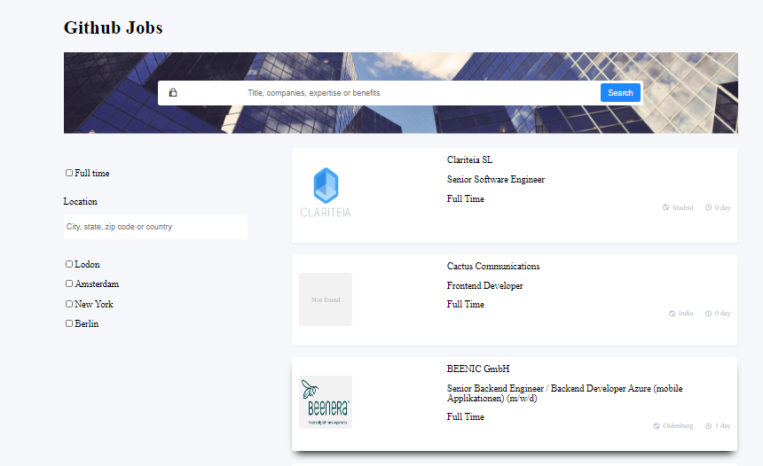

# Github Jobs

Here we are, the last graded project of this semester.

Your challenge: Create a job search using an API, and use React to handle the frontend. Don’t look at the existing solution. Fulfill user stories below:


- User story: I can see a list of jobs in a city by default
- User story: I can search for jobs with a given keyword
- User story: I can search for jobs with a city name, zip code or other location
- User story: I can select one option from at least 4 pre-defined options
- User story: I can search for a full-time job only
- User story: I can see a list of jobs with their logo, company name, location, and posted time.
- User story: When I select a job, I can see job descriptions and how to apply like the given design.
- User story: When I am on the job details page, I can go back to the search page
- User story (optional): I can see a list of jobs in the closest city from my location by default
- User story (optional): I can see jobs in different pages, 5 items each page

You’ll also have to apply a few concept we learned in class, such as a **reducer** and a global **context**. And there will be a bonus for those who can find a use case for a **compound component**.

**Icon**: https://google.github.io/material-design-icons/ (you can also use the react-icons package)

**API**: https://jobs.github.com/api. Use data from the API to create questions and answers.

*If you get some CORS errors, you can use https://cors-anywhere.herokuapp.com/ to help with accessing data from other websites that are normally forbidden by the same-origin policy of web browsers*

**Design** : https://www.figma.com/file/gAkVx9CdOqnJcCjJ7nVNkw

**Live app** : https://jolly-heisenberg-20c49e.netlify.app/

Once you completed, polish a nice readme submit your solutions on this link : https://forms.gle/Xg6kJMKmrBkyTe3TA, by providing URLs for both GitHub repository and live app on Netlify.

For the custom domain url you'll enter in netlify, please use the following naming convention : **github-jobs-_YOUR_FIRSTNAME_.netlify.app** (replace YOUR_FIRSTNAME by your firstname)

Good luck everybody!

Template for your readme :

<!-- Please update value in the {}  -->

<h1 align="center">Github Jobs</h1>

<div align="center">
  <h3>
    <a href="https://github-jobs-noeline.netlify.app/">
      Demo
    </a>
    <span> | </span>
    <a href="https://github.com/vakodrazan/github-jobs">
      Solution
    </a>
  </h3>
</div>

<!-- TABLE OF CONTENTS -->

## Table of Contents

-   [Overview](#overview)
    -   [Built With](#built-with)
-   [Features](#features)
-   [How to use](#how-to-use)
-   [Contact](#contact)
-   [Acknowledgements](#acknowledgements)

<!-- OVERVIEW -->

## Overview



Introduce your projects by taking a screenshot or a gif. Try to tell visitors a story about your project by answering:

-   Where can I see your demo?
-   What was your experience?
-   In a few sentences, explain the structure of your project.
-   If you had more time, what area of your project would you improve?
-   Did you learn anything new while working on this project?
-   What was the most challenging part for you?
-   Any other comments?

 **Where to see my demo**:
 - You can find it in netlify. [Github jobs](https://github-jobs-noeline.netlify.app/)
 - And you can check at the code in [github](https://github.com/vakodrazan/github-jobs)

 **Experience**:
 - First of all, this project was really hard for me. I found it difficult to achieve. 
 - I experienced that before even start coding, make a plan and think of what is possible to achieve and start from the easy part then delve into the complicated one. If I straight away do the hardest part I would not get anything works. The only way to overcome it, do it step by step.

 **Structure of my project**:
 - I have two different folders, one is for the components and the other one is for the main page.
 - In the components, there are some several folder because I add some specific `scss` files to style the file individually.
 - I have two different types of filter one is for the main data page, which you can find in the header. The other one has its own `API`. 
 - I think I could have had a new `API` for all filter.
 - I use `useReducer`, which sets in the `pages/GlobalContext` file. I did the first fetching in there as well.

 **Need to improve**:
 - In general, I would say, every part of my code needs improvement such as how I structure it. 
 - I would work on the filter and make it works nicely as it should be.
 - Also, if I had more time, I would work on the design page. I mean, I would split them to their own page, that will contains 5 items in each page. I didn't even know how could I achieve that. There is an existing `API` that contains the page but I didn't know where to start.
 - Then I will start refactoring it by using compound component if I had more time.

 **New things`: 
 - First of all, this project is really good for practicing and helps to think of how to overcome a big challenge. 
 - I leanrt how to manage my time of doing things. If I am sure that I can't finish it I tried to do it but that didn't help then I did another one then I could go back to it later.
 - I have never none that some data are forbiden by the same origin policy of web browsers. I need to add the CORS rules to achieve that. 
 - I have never thought of changing an element that set as a string value to a normal HTML. But there is a specific rule for that which I found, we need to use `dangerouslySetInnerHTML={{ __html: content }}`.

 **The most challenging part**:
 - First and foremost, finding which is the url to fetch was the first challenge I faced but I could resolve it.
 - Filtering the list as well is a biggest challenge which I couldn't do well. Especially the checkbox. I'm pretty sure if I had more time I would find a better way to solve it.
 - Lastly, the page which I didn't even touch. I tried to read some documents but that didn't help.
 

### Built With

<!-- This section should list any major frameworks that you built your project using. Here are a few examples.-->

-   [React](https://reactjs.org/)
-   [Styled-components](https://styled-components.com/)
-   [Sass](https://sass-lang.com/documentation/style-rules)

## Features

<!-- List the features of your application or follow the template. Don't share the figma file here :) -->
- [Github](https://github.com/vakodrazan/github-jobs)

## How To Use

<!-- Example: -->

To clone and run this application, you'll need [Git](https://git-scm.com) and [Node.js](https://nodejs.org/en/download/) (which comes with [npm](http://npmjs.com)) installed on your computer. From your command line:

```bash
# Clone this repository
$ git clone https://github.com/vakodrazan/github-jobs

# Install dependencies
$ npm install

# Run the app
$ npm start
```

## Acknowledgements

<!-- This section should list any articles or add-ons/plugins that helps you to complete the project. This is optional but it will help you in the future. For example: -->
- This [article](https://stackoverflow.com/questions/37337289/react-js-set-innerhtml-vs-dangerouslysetinnerhtml) helps me to deal with the html element that set in a string for each job items detail. I have to convert them into a normal html element.
- When I first fetch the data. I got a problem with the CORS thing, so I didn't know where to add the specific url for that. This [document](https://stackoverflow.com/questions/29670703/how-to-use-cors-anywhere-to-reverse-proxy-and-add-cors-headers#:~:text=CORS%20Anywhere%20helps%20with%20accessing,with%20the%20API%20URL.%22) helped me a lot.

## Contact

-   Website [your-website.com](https://{your-web-site-link})
-   GitHub [@your-username](https://{github.com/your-usermame})
